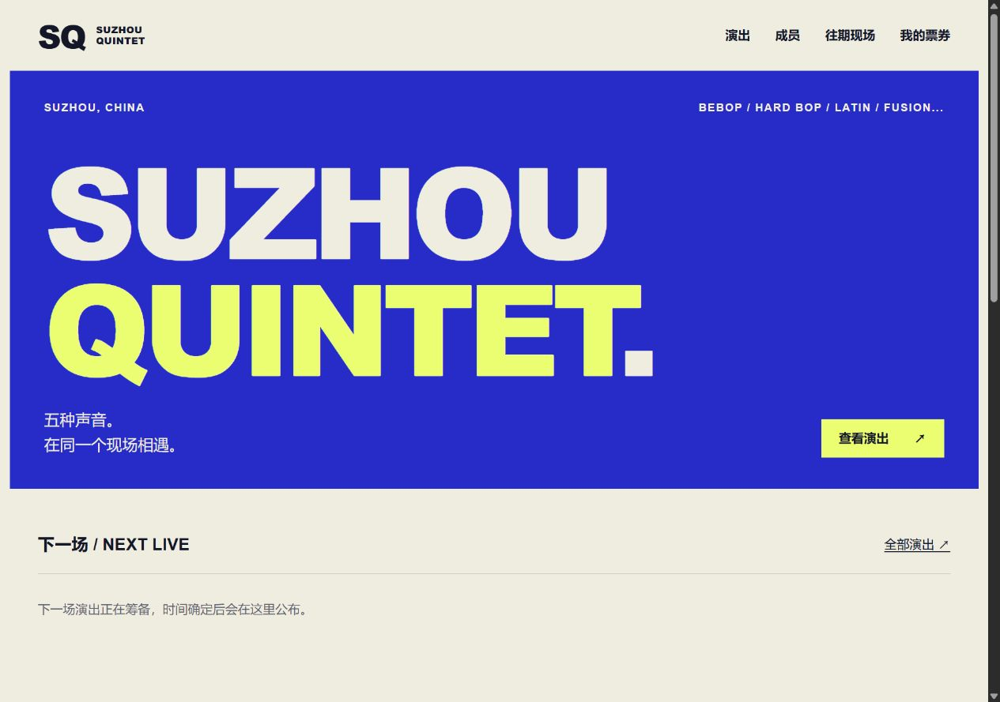

# SUZHOU QUINTET

苏州爵士五重奏官网，提供演出信息、成员介绍、往期现场、内容管理及电子票功能。

## 技术结构

Python 3.13、Flask、Jinja 和 SQLite。页面由服务端渲染，CSS 与 JavaScript 提供响应式布局、相册编辑和交互增强。应用采用单实例部署，生产服务使用 Waitress。

| 文件或目录 | 职责 |
| --- | --- |
| app.py | 页面路由、表单及后台操作 |
| config.py / security.py | 环境配置、会话、CSRF 与限流 |
| ticketing.py | 库存、订单、出票、退款记录与核销 |
| db.py / schema.sql | 数据库连接、表结构与索引 |
| gallery_uploads.py | 图片校验、重新编码与相册管理 |
| maintenance.py | 健康检查、部署检查与备份校验 |
| public_pages.py | 隐私页面、站点地图与搜索元数据 |
| templates/ / static/ | 页面模板、样式与脚本 |
| serve.py / deploy/ | 服务入口与部署配置示例 |
| tests/ / .github/workflows/ | 回归测试与自动检查 |

## 功能

- 演出详情、成员阵容、现场照片、视频链接、地图和 ICS 日历。
- 后台发布与草稿管理、图片批量上传、订单筛选和操作审计。
- 服务端计价、库存事务、待付款占位和防重复下单。
- 人工确认到账后生成独立票码及二维码，支持票券核销和退款记录。
- 数据库与图片的完整备份、文件校验和健康检查。

## 售票流程

创建订单 → 展示收款二维码 → 观众付款并申报 → 工作人员核对实际到账 → 出票 → 入场核销。

收款二维码与电子票二维码用途不同。付款申报不会自动出票；付款和退款由工作人员人工处理，当前未接入支付平台 API。票券状态在服务器检查，每张票只能核销一次。

## 安全与数据

密码使用哈希保存，管理员会话支持撤销与超时。写入操作校验 CSRF，查询使用 SQL 参数绑定；权限、金额、库存及订单状态由服务器验证。图片上传检查格式、大小和像素，重新编码并清除元数据。

生产配置要求随机密钥、HTTPS Cookie、可信域名和明确的代理设置。真实密钥、数据库、上传文件及备份不属于公开源码；`.env.example` 仅包含配置变量示例。

回归测试覆盖订单流程、库存竞争、访问权限、会话撤销、票券核销和备份恢复。GitHub Actions 执行测试、代码格式检查及依赖漏洞扫描。
